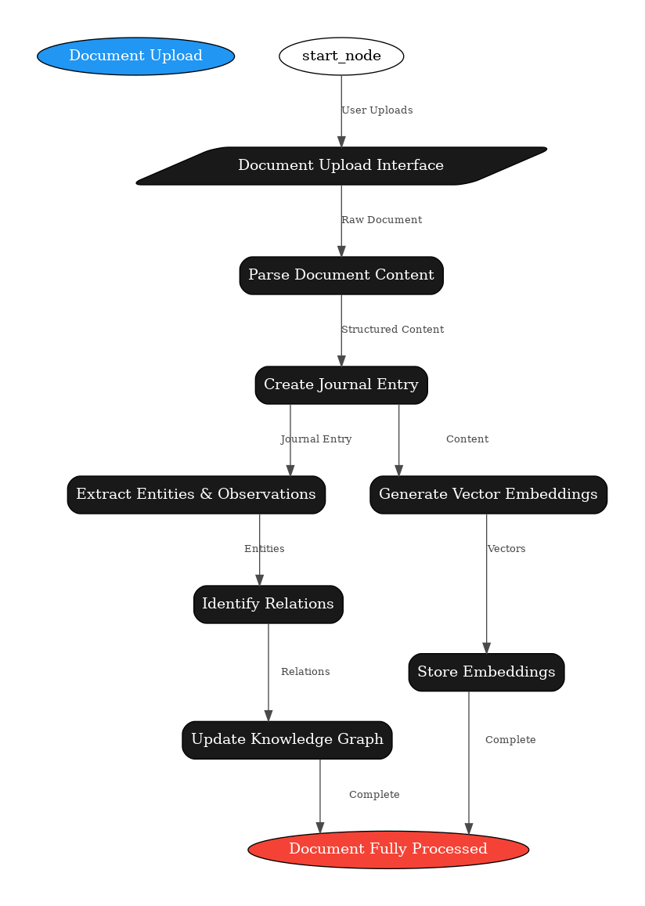

# Introducing YouTwo

Welcome to YouTwo, your personal knowledge platform for transforming documents into structured, interconnected knowledge.

YouTwo helps you build a personal knowledge graph from your documents, enabling powerful semantic search, relationship discovery, and intuitive visualization of your information landscape.

<!-- truncate -->

## What is YouTwo?

YouTwo is a document processing system that transforms your markdown files, PDFs, and other documents into a rich knowledge graph. By extracting entities, identifying relationships, and generating semantic embeddings, YouTwo creates a comprehensive map of your personal knowledge.

## How it Works

The YouTwo document processing pipeline seamlessly transforms raw documents into structured knowledge:

1. **Upload & Parse**: Your documents are uploaded, parsed, and chunked for efficient processing
2. **Extract & Embed**: Entities are identified, and vector embeddings capture semantic meaning
3. **Connect & Visualize**: Relationships are discovered, and your knowledge graph comes to life

## Getting Started

Begin building your knowledge base by uploading your first document. The more content you add, the richer and more valuable your knowledge graph becomes.

Ready to transform how you organize and access your knowledge? Start with YouTwo today!
